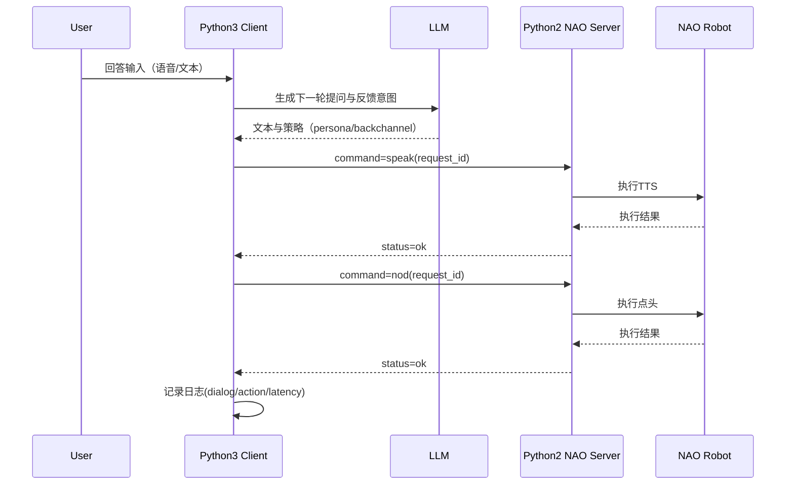
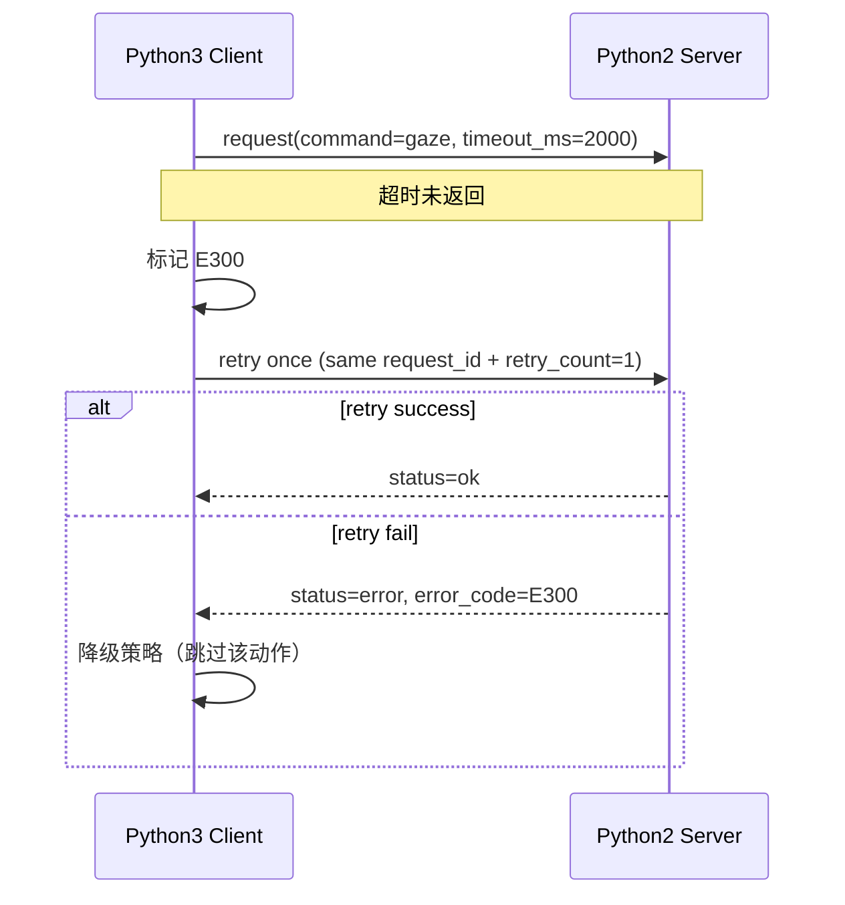

# 《通信协议 v1》

> 项目：NAO + LLM 模拟面试系统  
> 协议角色：Python3 Client（决策层） ↔ Python2 NAO Server（执行层）  
> 版本：v1.0  
> 用途：联调规范 / 开发对接 / 日志追踪

---

## 1. 设计目标

1. 让 Python3 与 Python2 **解耦**：客户端只发“意图命令”，服务端负责硬件执行。  
2. 支持实验可复现：每条命令都可追踪到 session / 条件 / 轮次。  
3. 支持稳定联调：统一响应结构、错误码、超时与重试策略。

---

## 2. 传输与封装

## 2.1 传输建议
- 本地联调阶段：HTTP（`POST /command`）或 TCP JSON line 均可。
- 推荐先 HTTP（易调试、日志可视化方便）。

## 2.2 字符编码
- UTF-8

## 2.3 消息格式
- JSON

---

## 3. 通用消息结构

## 3.1 请求（Client -> Server）

```json
{
  "protocol_version": "1.0",
  "request_id": "REQ_20260425_0001",
  "timestamp_ms": 1777085400123,
  "session_id": "S20260425_001",
  "participant_id": "P032",
  "condition_id": "C1",
  "turn_id": "T007",
  "command": "speak",
  "payload": {
    "text": "很好，我们继续下一题。",
    "voice": "default",
    "speed": 95,
    "volume": 70
  },
  "timeout_ms": 5000
}
```

## 3.2 响应（Server -> Client）

```json
{
  "protocol_version": "1.0",
  "request_id": "REQ_20260425_0001",
  "server_timestamp_ms": 1777085400456,
  "status": "ok",
  "error_code": "E000",
  "message": "success",
  "result": {
    "execution_ms": 322,
    "robot_state": "idle"
  }
}
```

`status` 取值：
- `ok`：执行成功
- `error`：执行失败
- `accepted`：异步命令已接收（可选扩展）

---

## 4. 命令字典（Command Dictionary）

## 4.1 基础控制类

### 4.1.1 `ping`
用途：健康检查。

请求 `payload`：
```json
{}
```

成功响应 `result`：
```json
{
  "alive": true,
  "server_uptime_ms": 120034
}
```

### 4.1.2 `reset_posture`
用途：恢复默认姿态，防止动作漂移。

请求 `payload`：
```json
{
  "posture": "stand_init"
}
```

---

## 4.2 语音输出类

### 4.2.1 `speak`
用途：TTS 播报文本。

请求 `payload`：
```json
{
  "text": "你的这个回答有进步。",
  "voice": "default",
  "speed": 95,
  "volume": 70,
  "interrupt": false
}
```

参数约束：
- `text`：非空字符串，建议 < 300 字
- `speed`：50–200
- `volume`：0–100

---

## 4.3 非语言行为类（backchannel）

### 4.3.1 `nod`
用途：点头反馈。

请求 `payload`：
```json
{
  "count": 2,
  "amplitude": "small",
  "tempo": "normal"
}
```

### 4.3.2 `gaze`
用途：注视控制。

请求 `payload`：
```json
{
  "target": "user",
  "duration_ms": 1800,
  "mode": "smooth"
}
```

`target` 推荐枚举：
- `user`
- `neutral`
- `down_left`
- `down_right`

### 4.3.3 `gesture`
用途：预定义手势动作。

请求 `payload`：
```json
{
  "name": "encourage_open_palm",
  "intensity": "low"
}
```

---

## 4.4 复合动作类

### 4.4.1 `perform_sequence`
用途：按顺序执行多个动作（用于高同步条件）。

请求 `payload`：
```json
{
  "steps": [
    {"command": "gaze", "payload": {"target": "user", "duration_ms": 1200}},
    {"command": "nod", "payload": {"count": 1, "amplitude": "small"}},
    {"command": "speak", "payload": {"text": "我明白你的意思，我们继续。", "speed": 95, "volume": 70}}
  ],
  "stop_on_error": true
}
```

---

## 5. 错误码规范（Error Codes）

| 错误码 | 含义 | 常见原因 | Client处理建议 |
|---|---|---|---|
| E000 | Success | - | 正常继续 |
| E100 | Invalid JSON | 报文格式错误 | 记录并终止该请求 |
| E101 | Missing field | 缺失必要字段 | 修正构造逻辑 |
| E102 | Invalid command | 未注册命令 | 回退到安全动作 |
| E103 | Invalid payload | 参数超范围/枚举非法 | 参数校验后重发 |
| E200 | Robot disconnected | NAO连接断开 | 触发重连流程 |
| E201 | Motion module unavailable | 动作模块不可用 | 降级为 `speak` |
| E202 | TTS module unavailable | 语音模块不可用 | 降级为文本显示（若有） |
| E300 | Execution timeout | 执行超时 | 可重试1次，仍失败则跳过 |
| E301 | Busy | 机器人忙 | 延迟重试或排队 |
| E500 | Internal server error | 服务端异常 | 记录堆栈并中断session |

---

## 6. 时序图（Mermaid）

## 6.1 单轮问答（同步调用）



## 6.2 超时与重试



---

## 7. 幂等与重试规则

1. `request_id` 全局唯一。  
2. 同一 `request_id` 重复到达时，Server 应返回相同结果（幂等）。  
3. Client 对可重试错误（`E300`, `E301`, `E200`）最多重试 1 次。  
4. 对参数错误（`E101~E103`）不重试，直接修复逻辑。

---

## 8. 日志与追踪规范

Client 与 Server 均需记录：
- `request_id`
- `session_id`
- `condition_id`
- `turn_id`
- `command`
- `status`
- `error_code`
- `execution_ms`

推荐日志文件：
- `logs/session_<session_id>.jsonl`
- 每行一条 JSON，便于后处理。

---

## 9. Python3 客户端起步对接清单（开发前置）

1. 定义 `CommandClient`：
   - `send(command, payload, timeout_ms)`
   - 自动注入 `request_id/session_id/turn_id`

2. 定义 `RobotActionAdapter`：
   - `speak(text, style)`
   - `backchannel(profile)`
   - `reset()`

3. 定义 `ErrorPolicy`：
   - 可重试错误重试1次
   - 不可恢复错误触发 session 安全中止

4. 先联调最小命令集：
   - `ping`
   - `speak`
   - `nod`
   - `gaze`
   - `reset_posture`

---

## 10. 联调验收标准（v1）

- 连续 30 分钟运行无崩溃。  
- 命令成功率 ≥ 98%（非网络断连场景）。  
- 平均响应时延：
  - `speak` 指令响应（接收确认）< 300ms
  - `nod/gaze` 执行完成 < 2000ms
- 所有错误均可映射到标准错误码。

---

## 11. 面向实验流程的扩展建议（v1.1 草案）

> 说明：以下内容是对你们当前实验目标的协议层补充建议，便于 Python3 与 Python2 对齐实现。

### 11.1 阶段事件（建议由 Python3 记录）

建议在会话日志中新增 `stage_event`，用于标记阶段切换：

```json
{
  "event_type": "stage_event",
  "session_id": "S20260425_001",
  "stage": "warmup",
  "phase": "enter",
  "timestamp_ms": 1777085400123,
  "meta": {
    "persona_mode": "neutral",
    "objective": "baseline_collection"
  }
}
```

建议阶段枚举：
- `warmup`（中立）
- `task_intro`
- `formal_interview`
- `closing_and_questionnaire`

### 11.2 指标上报（建议由 Python3 聚合）

建议增加 `metric_event` 日志记录（而非作为机器人命令发送）：

```json
{
  "event_type": "metric_event",
  "session_id": "S20260425_001",
  "turn_id": "T007",
  "stage": "formal_interview",
  "metrics": {
    "speech_rate_cpm": 238.5,
    "disfluency_ratio": 0.034,
    "gaze_contact_ratio": 0.62
  },
  "timestamp_ms": 1777085432123
}
```

定义建议：
- `speech_rate_cpm`：每分钟汉字数（char/min）
- `disfluency_ratio`：停顿词总次数 / 总字数
- `gaze_contact_ratio`：看向机器人头部时长 / 总回答时长

### 11.3 组件分工（与协议实现相关）

- Python3：阶段状态机、ASR/视觉处理、指标计算、事件日志。
- Python2：`/command` 执行层（TTS/动作）与错误码返回。

该分工可保持协议稳定，避免 Python2 服务端承担重分析任务。
